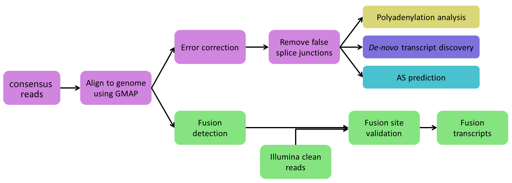
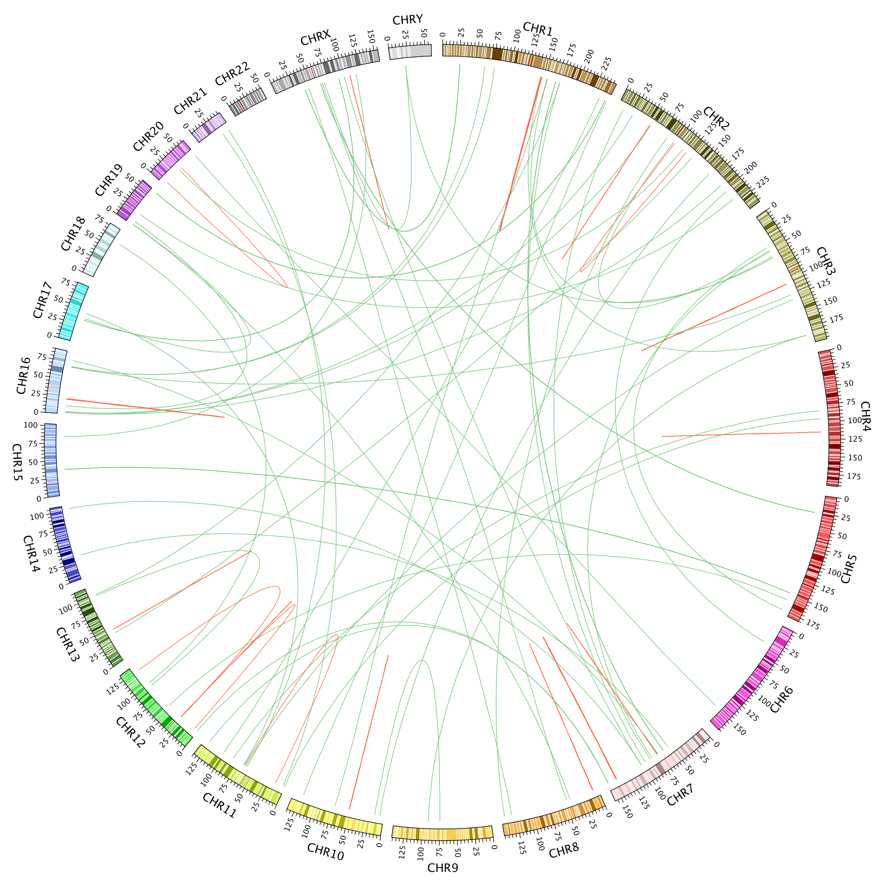
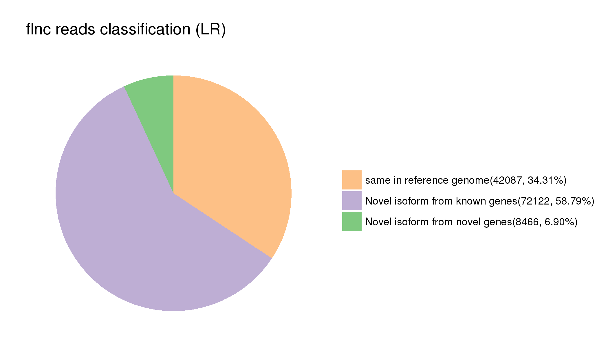
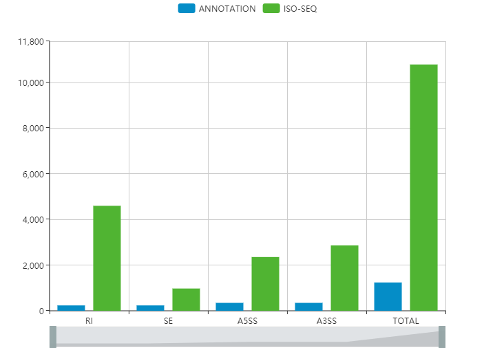

# PBTranscriptStructure
To determine the structure of ISO-seq transcripts, icluding altersplicing, APA, fusion transcript, etc.

  

dependency:

SpliceGrapher(python lib)

STAR

circos

output:

  
  
  
  
  

