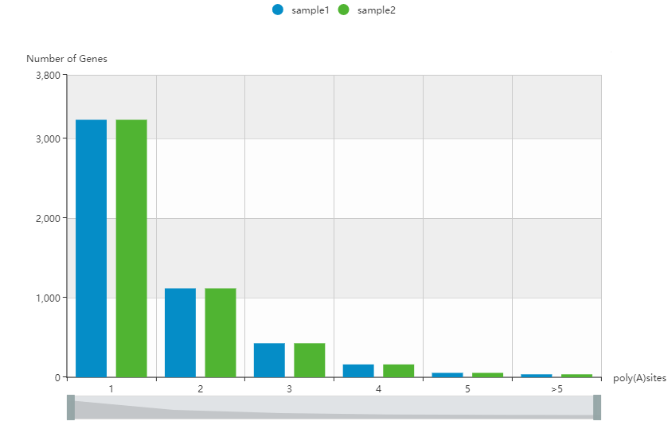

# PBTranscriptStructure
To determine the structure of ISO-seq transcripts, icluding altersplicing, APA, fusion transcript, etc.

  

dependency:

SpliceGrapher(python lib)

STAR

circos

TAPIS

output:

   &nbsp; &nbsp; &nbsp;
   &nbsp; &nbsp; &nbsp;
   &nbsp; &nbsp; &nbsp;
   &nbsp; &nbsp; &nbsp;
  

